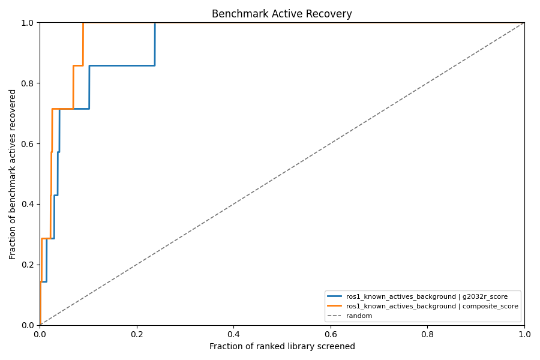
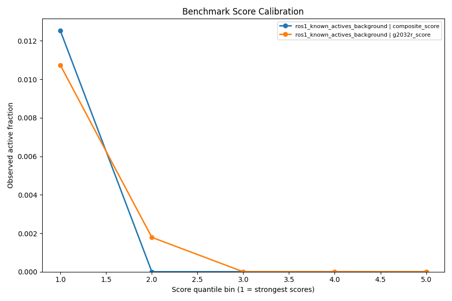

# ROS1 Drug Repurposing Screen — Results

**Date:** 2026-04-01

**Patient context:** 39yo, lung adenocarcinoma.
EZR::ROS1 fusion (exon 34), MET IHC 3+ 50%, PD-L1 TPS 95%.
High risk of CNS metastasis.

## Methods

- **Targets:** ROS1 G2032R (PDB 9QEK), ROS1 WT (PDB 7Z5X), MET (PDB 2WGJ)
- **Grid box:** 25x25x25 A centered on ATP-binding pocket catalytic triad
- **Docking:** AutoDock Vina
  - Campaign 1: All drugs, exhaustiveness=8
  - Campaign 2: Top 50 + controls, exhaustiveness=32, 9 poses
  - Campaign 3: Top 20 + controls vs WT and MET, exhaustiveness=32
- **Library:** 2800 FDA-approved drugs (Selleckchem L1300 + L8000)

## Re-docking Validation

```
Aligned RMSD (geometry-aware estimate): 3.08 A
Naive RMSD (unaligned): 7.76 A
Score: -9.0 kcal/mol
Crystal heavy atoms: 31
Docked heavy atoms:  33
Matched atoms: 31
Method: multi-start ICP (element-constrained Hungarian + Kabsch)

NOTE: Aligned RMSD 3.08 A > 2.0 A -- only moderate support for pose recovery
The original 6.87 A was an artifact of comparing coordinates across different reference frames (crystal vs minimised receptor).
When atom counts differ, this RMSD remains an approximate geometry-based estimate rather than a chemistry-exact atom mapping.
```

## Known TKI Control Scores

| drug_name                 |   g2032r_score |   wt_score |   met_score |   cns_mpo | cns_penetrant   |
|:--------------------------|---------------:|-----------:|------------:|----------:|:----------------|
| entrectinib               |        -10.662 |     -9.977 |     -10.188 |      2.25 | False           |
| Entrectinib (RXDX-101)    |        -10.512 |    -10.171 |     -10.234 |      1.75 | False           |
| Lorlatinib?(PF-6463922)   |         -9.735 |     -9.369 |      -9.528 |      4.25 | False           |
| zidesamtinib              |         -9.1   |     -9.165 |      -9.837 |      1.98 | False           |
| taletrectinib             |         -9.02  |     -8.482 |      -9.721 |      3.26 | False           |
| Ceritinib (LDK378)        |         -8.947 |     -8.462 |      -8.896 |      0.99 | False           |
| Ceritinib dihydrochloride |         -8.865 |     -8.13  |      -8.763 |      0.99 | False           |
| lorlatinib                |         -8.763 |     -7.811 |      -8.701 |      3.22 | True            |
| (S)-crizotinib            |         -8.728 |     -8.18  |     -10.221 |      2.78 | False           |
| Crizotinib hydrochloride  |         -8.472 |     -8.625 |     -10.166 |      2.78 | False           |
| Crizotinib (PF-02341066)  |         -8.439 |     -8.613 |     -10.19  |      2.78 | False           |
| crizotinib                |         -8.331 |     -8.462 |      -9.584 |      2.81 | True            |
| repotrectinib             |         -7.891 |     -7.473 |      -8.677 |      5.25 | False           |
| Repotrectinib (TPX-0005)  |         -7.245 |     -6.829 |      -5.707 |      5.25 | False           |

## Top 20 Repurposing Candidates

| drug_name                          |   g2032r_score |   composite_score |   cns_mpo | cns_penetrant   |    mw |   clogp | target                   |
|:-----------------------------------|---------------:|------------------:|----------:|:----------------|------:|--------:|:-------------------------|
| Lomitapide                         |        -10.955 |           -11.455 |      2.25 | False           | 693.7 |    8.38 | MTP                      |
| Dutasteride                        |        -10.841 |           -11.341 |      2.25 | False           | 528.5 |    6.58 | 5-alpha Reductase        |
| Lomitapide Mesylate                |        -10.745 |           -11.245 |      2.25 | False           | 693.7 |    8.38 | MTP                      |
| Zafirlukast (ICI-204219)           |        -10.66  |           -11.16  |      0.96 | False           | 575.7 |    5.7  | LTR                      |
| Tucatinib                          |        -10.367 |           -10.867 |      1.42 | False           | 480.5 |    5.09 | EGFR,HER2                |
| Bardoxolone Methyl                 |        -10.588 |           -10.788 |      3    | False           | 505.7 |    6.38 | nan                      |
| Irinotecan hydrochloride           |        -10.271 |           -10.771 |      2.22 | False           | 586.7 |    4.09 | Topoisomerase            |
| Irinotecan (CPT-11) HCl Trihydrate |        -10.27  |           -10.77  |      2.22 | False           | 586.7 |    4.09 | Topoisomerase            |
| umbralisib (TGR-1202)              |        -10.262 |           -10.762 |      1.8  | False           | 571.6 |    6.66 | PI3K                     |
| Irinotecan (CPT-11)                |        -10.258 |           -10.758 |      2.22 | False           | 586.7 |    4.09 | Topoisomerase            |
| Ubrogepant                         |        -10.145 |           -10.645 |      2.64 | False           | 549.6 |    3.53 | CGRP Receptor            |
| Tepotinib (EMD 1214063)            |        -10.143 |           -10.643 |      3.48 | False           | 492.6 |    4.01 | Autophagy,c-Met          |
| Bromocriptine Mesylate             |        -10.041 |           -10.541 |      1.69 | False           | 654.6 |    3.19 | Others                   |
| Piperaquine phosphate              |        -10.01  |           -10.51  |      2.91 | False           | 535.5 |    5.42 | Anti-infection           |
| Azilsartan Medoxomil               |         -9.936 |           -10.436 |      1.47 | False           | 568.5 |    4.71 | Angiotensin Receptor     |
| Fluzoparib (SHR-3162)              |         -9.929 |           -10.429 |      4.21 | False           | 472.4 |    2.92 | PARP                     |
| Nilotinib (AMN-107)                |         -9.926 |           -10.426 |      1.87 | False           | 529.5 |    6.36 | AMPK,Autophagy,Bcr-Abl   |
| Enoxolone                          |        -10.115 |           -10.315 |      2.56 | False           | 470.7 |    6.41 | Dehydrogenase            |
| Tanshinone I                       |         -9.803 |           -10.303 |      5.18 | True            | 276.3 |    4.1  | Phospholipase (e.g. PLA) |
| Chlorhexidine diacetate            |         -9.766 |           -10.266 |      0.62 | False           | 505.5 |    4.18 | Anti-infection           |

## Score Distribution


## Top 20 vs Controls


## CNS Penetration vs Binding


## G2032R vs WT Selectivity


## Dual ROS1/MET Activity


## Benchmark Metrics

| benchmark_id                  | benchmark_mode       | score_column    |   roc_auc |   average_precision |     ef1 |     nef1 |     ef5 |     nef5 |    ef10 |    nef10 |   median_active_rank |   hits_top_10 |   hits_top_25 |   hits_top_50 |
|:------------------------------|:---------------------|:----------------|----------:|--------------------:|--------:|---------:|--------:|---------:|--------:|---------:|---------------------:|--------------:|--------------:|--------------:|
| ros1_known_actives_background | active_vs_background | g2032r_score    |  0.935133 |           0.0642224 | 14.2551 | 0.142857 | 14.2551 | 0.714286 | 7.12755 | 0.714286 |                  104 |             1 |             1 |             2 |
| ros1_known_actives_background | active_vs_background | composite_score |  0.967553 |           0.0931942 | 28.5102 | 0.285714 | 14.2551 | 0.714286 | 9.97857 | 1        |                   67 |             1 |             2 |             2 |

## Benchmark Enrichment



## Benchmark Calibration




## Interactive 3D Binding Poses

- [Azilsartan_Medoxomil](poses_3d/Azilsartan_Medoxomil.html)
- [Bardoxolone_Methyl](poses_3d/Bardoxolone_Methyl.html)
- [Bromocriptine_Mesylate](poses_3d/Bromocriptine_Mesylate.html)
- [Chlorhexidine_diacetate](poses_3d/Chlorhexidine_diacetate.html)
- [Dutasteride](poses_3d/Dutasteride.html)
- [Enoxolone](poses_3d/Enoxolone.html)
- [Fluzoparib_(SHR-3162)](poses_3d/Fluzoparib_(SHR-3162).html)
- [Irinotecan_(CPT-11)](poses_3d/Irinotecan_(CPT-11).html)
- [Irinotecan_(CPT-11)_HCl_Trihydrate](poses_3d/Irinotecan_(CPT-11)_HCl_Trihydrate.html)
- [Irinotecan_hydrochloride](poses_3d/Irinotecan_hydrochloride.html)
- [Lomitapide](poses_3d/Lomitapide.html)
- [Lomitapide_Mesylate](poses_3d/Lomitapide_Mesylate.html)
- [Nilotinib_(AMN-107)](poses_3d/Nilotinib_(AMN-107).html)
- [Piperaquine_phosphate](poses_3d/Piperaquine_phosphate.html)
- [Tanshinone_I](poses_3d/Tanshinone_I.html)
- [Tepotinib_(EMD_1214063)](poses_3d/Tepotinib_(EMD_1214063).html)
- [Tucatinib](poses_3d/Tucatinib.html)
- [Ubrogepant](poses_3d/Ubrogepant.html)
- [Zafirlukast_(ICI-204219)](poses_3d/Zafirlukast_(ICI-204219).html)
- [umbralisib_(TGR-1202)](poses_3d/umbralisib_(TGR-1202).html)
- [zidesamtinib_reference](poses_3d/zidesamtinib_reference.html)


## Summary

- **Drugs screened:** 2800
- **Best TKI score:** -10.7 kcal/mol
- **Repurposing candidates** (within 2 kcal/mol of best TKI): 199
- **Composite scoring:** G2032R binding + CNS MPO bonus + MET dual-activity bonus + mutant selectivity bonus

## Limitations

- **Docking != binding.** Vina scores are approximations. Experimental validation is required.
- **Scoring function limitations.** Vina's empirical scoring may miss important interactions
  (e.g., cation-pi, halogen bonds, water-mediated contacts).
- **Static receptor.** No induced fit or protein flexibility modeled.
- **Off-target effects.** Predicted binding does not account for selectivity across the kinome.

## Current Improvement Status

- **Validation status** — Alignment-aware RMSD analysis completed in 06_improve.py.
- **Multi-conformer docking** — Campaign 2 was refreshed from multi-conformer docking outputs.
- **ADMET annotation** — Top-hit ADMET columns are present in `top20_hits.csv`.

## Next Steps

1. **Discuss with oncologist** — review candidates for clinical plausibility
2. **Experimental validation** — CRO testing (e.g., Eurofins, Reaction Biology)
   for top candidates: biochemical kinase assay, cell-based ROS1 activity
3. **Community** — share findings with ROS1ders patient network
4. **Molecular dynamics** — run MD simulations on top 3-5 hits for binding stability
