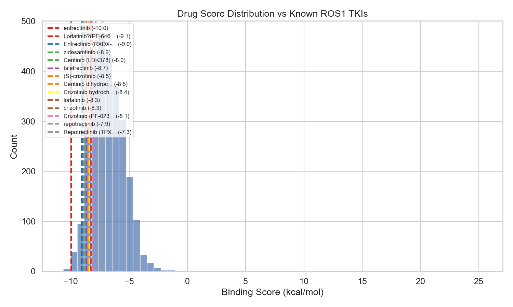
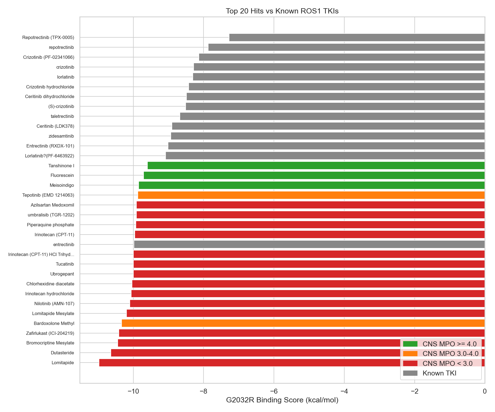
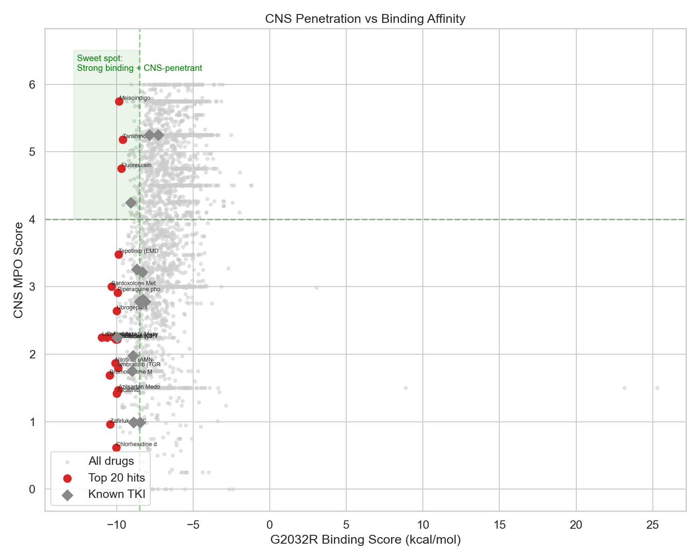
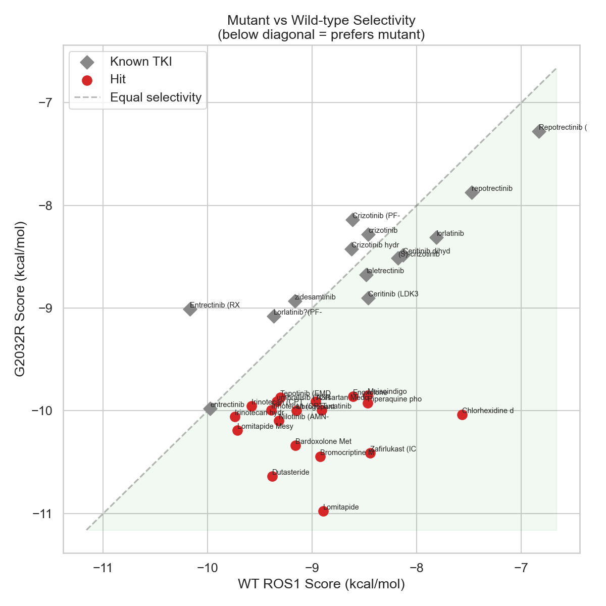
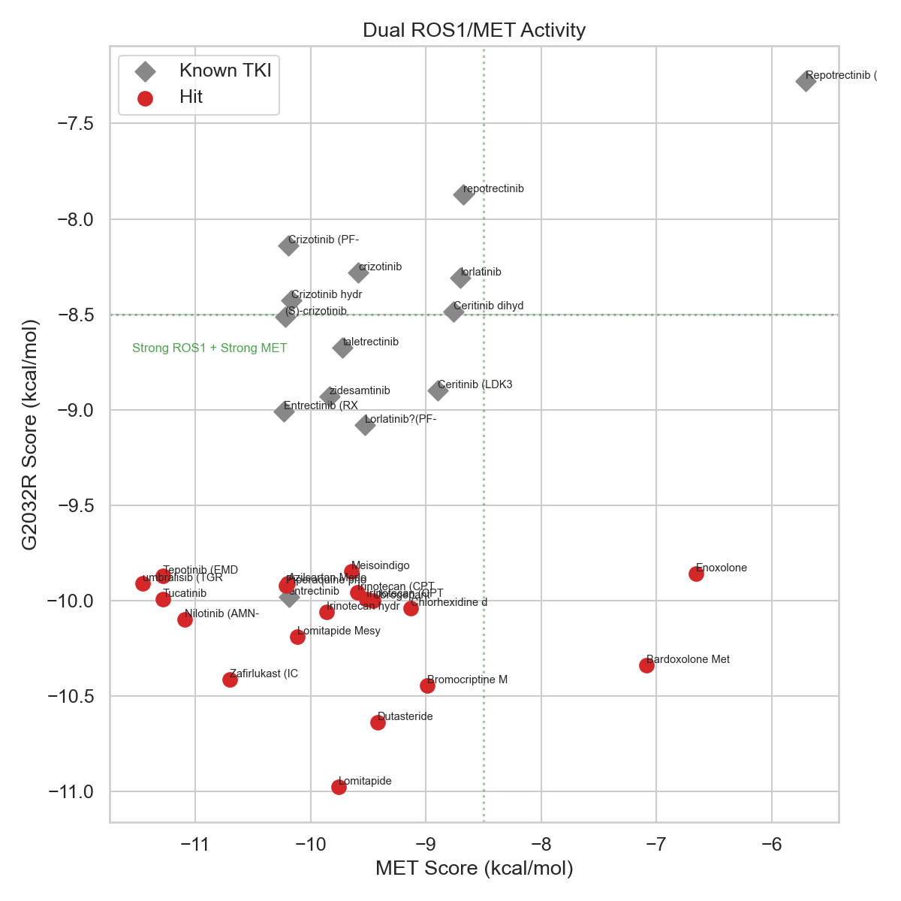

    # ROS1 Drug Repurposing Screen — Results

    **Date:** 2026-03-31

    **Patient context:** 39yo, lung adenocarcinoma.
    EZR::ROS1 fusion (exon 34), MET IHC 3+ 50%, PD-L1 TPS 95%.
    High risk of CNS metastasis.

    ## Methods

    - **Targets:** ROS1 G2032R (PDB 9QEK), ROS1 WT (PDB 7Z5X), MET (PDB 2WGJ)
    - **Grid box:** 25x25x25 A centered on ATP-binding pocket catalytic triad
    - **Docking:** AutoDock Vina
      - Campaign 1: All drugs, exhaustiveness=8
      - Campaign 2: Top 50 + controls, exhaustiveness=32, 9 poses
      - Campaign 3: Top 20 + controls vs WT and MET, exhaustiveness=32
    - **Library:** 2800 FDA-approved drugs (Selleckchem L1300 + L8000)

    ## Re-docking Validation

    ```
    RMSD: 6.87 A
Score: -9.0 kcal/mol
WARNING: RMSD > 2.0 A — docking protocol may need adjustment
    ```

    ## Known TKI Control Scores

    | drug_name                 |   g2032r_score |   wt_score |   met_score |   cns_mpo | cns_penetrant   |
|:--------------------------|---------------:|-----------:|------------:|----------:|:----------------|
| entrectinib               |         -9.979 |     -9.977 |     -10.188 |      2.25 | False           |
| Lorlatinib?(PF-6463922)   |         -9.079 |     -9.369 |      -9.528 |      4.25 | False           |
| Entrectinib (RXDX-101)    |         -9.008 |    -10.171 |     -10.234 |      1.75 | False           |
| zidesamtinib              |         -8.931 |     -9.165 |      -9.837 |      1.98 | False           |
| Ceritinib (LDK378)        |         -8.899 |     -8.462 |      -8.896 |      0.99 | False           |
| taletrectinib             |         -8.676 |     -8.482 |      -9.721 |      3.26 | False           |
| (S)-crizotinib            |         -8.512 |     -8.18  |     -10.221 |      2.78 | False           |
| Ceritinib dihydrochloride |         -8.485 |     -8.13  |      -8.763 |      0.99 | False           |
| Crizotinib hydrochloride  |         -8.426 |     -8.625 |     -10.166 |      2.78 | False           |
| lorlatinib                |         -8.309 |     -7.811 |      -8.701 |      3.22 | True            |
| crizotinib                |         -8.281 |     -8.462 |      -9.584 |      2.81 | True            |
| Crizotinib (PF-02341066)  |         -8.138 |     -8.613 |     -10.19  |      2.78 | False           |
| repotrectinib             |         -7.872 |     -7.473 |      -8.677 |      5.25 | False           |
| Repotrectinib (TPX-0005)  |         -7.279 |     -6.829 |      -5.707 |      5.25 | False           |

    ## Top 20 Repurposing Candidates

    | drug_name                          |   g2032r_score |   composite_score |   cns_mpo | cns_penetrant   |    mw |   clogp | target                   |
|:-----------------------------------|---------------:|------------------:|----------:|:----------------|------:|--------:|:-------------------------|
| Lomitapide                         |        -10.976 |           -11.476 |      2.25 | False           | 693.7 |    8.38 | MTP                      |
| Dutasteride                        |        -10.637 |           -11.137 |      2.25 | False           | 528.5 |    6.58 | 5-alpha Reductase        |
| Bromocriptine Mesylate             |        -10.444 |           -10.944 |      1.69 | False           | 654.6 |    3.19 | Others                   |
| Zafirlukast (ICI-204219)           |        -10.413 |           -10.913 |      0.96 | False           | 575.7 |    5.7  | LTR                      |
| Meisoindigo                        |         -9.848 |           -10.848 |      5.75 | True            | 276.3 |    2.53 | Others                   |
| Lomitapide Mesylate                |        -10.19  |           -10.69  |      2.25 | False           | 693.7 |    8.38 | MTP                      |
| Nilotinib (AMN-107)                |        -10.097 |           -10.597 |      1.87 | False           | 529.5 |    6.36 | AMPK,Autophagy,Bcr-Abl   |
| Irinotecan hydrochloride           |        -10.057 |           -10.557 |      2.22 | False           | 586.7 |    4.09 | Topoisomerase            |
| Chlorhexidine diacetate            |        -10.038 |           -10.538 |      0.62 | False           | 505.5 |    4.18 | Anti-infection           |
| Bardoxolone Methyl                 |        -10.337 |           -10.537 |      3    | False           | 505.7 |    6.38 | nan                      |
| Ubrogepant                         |         -9.998 |           -10.498 |      2.64 | False           | 549.6 |    3.53 | CGRP Receptor            |
| Tucatinib                          |         -9.994 |           -10.494 |      1.42 | False           | 480.5 |    5.09 | EGFR,HER2                |
| Irinotecan (CPT-11) HCl Trihydrate |         -9.993 |           -10.493 |      2.22 | False           | 586.7 |    4.09 | Topoisomerase            |
| Irinotecan (CPT-11)                |         -9.956 |           -10.456 |      2.22 | False           | 586.7 |    4.09 | Topoisomerase            |
| Piperaquine phosphate              |         -9.923 |           -10.423 |      2.91 | False           | 535.5 |    5.42 | Anti-infection           |
| Azilsartan Medoxomil               |         -9.911 |           -10.411 |      1.47 | False           | 568.5 |    4.71 | Angiotensin Receptor     |
| umbralisib (TGR-1202)              |         -9.911 |           -10.411 |      1.8  | False           | 571.6 |    6.66 | PI3K                     |
| Tepotinib (EMD 1214063)            |         -9.87  |           -10.37  |      3.48 | False           | 492.6 |    4.01 | Autophagy,c-Met          |
| Fluorescein                        |         -9.705 |           -10.205 |      4.75 | True            | 332.3 |    3.67 | Dyes                     |
| Tanshinone I                       |         -9.597 |           -10.097 |      5.18 | True            | 276.3 |    4.1  | Phospholipase (e.g. PLA) |

    ## Score Distribution

    

    ## Top 20 vs Controls

    

    ## CNS Penetration vs Binding

    

    ## G2032R vs WT Selectivity

    

    ## Dual ROS1/MET Activity

    

    ## Interactive 3D Binding Poses

    - [Azilsartan_Medoxomil](poses_3d/Azilsartan_Medoxomil.html)
- [Bardoxolone_Methyl](poses_3d/Bardoxolone_Methyl.html)
- [Bromocriptine_Mesylate](poses_3d/Bromocriptine_Mesylate.html)
- [Chlorhexidine_diacetate](poses_3d/Chlorhexidine_diacetate.html)
- [Dutasteride](poses_3d/Dutasteride.html)
- [Fluorescein](poses_3d/Fluorescein.html)
- [Irinotecan_(CPT-11)](poses_3d/Irinotecan_(CPT-11).html)
- [Irinotecan_(CPT-11)_HCl_Trihydrate](poses_3d/Irinotecan_(CPT-11)_HCl_Trihydrate.html)
- [Irinotecan_hydrochloride](poses_3d/Irinotecan_hydrochloride.html)
- [Lomitapide](poses_3d/Lomitapide.html)
- [Lomitapide_Mesylate](poses_3d/Lomitapide_Mesylate.html)
- [Meisoindigo](poses_3d/Meisoindigo.html)
- [Nilotinib_(AMN-107)](poses_3d/Nilotinib_(AMN-107).html)
- [Piperaquine_phosphate](poses_3d/Piperaquine_phosphate.html)
- [Tanshinone_I](poses_3d/Tanshinone_I.html)
- [Tepotinib_(EMD_1214063)](poses_3d/Tepotinib_(EMD_1214063).html)
- [Tucatinib](poses_3d/Tucatinib.html)
- [Ubrogepant](poses_3d/Ubrogepant.html)
- [Zafirlukast_(ICI-204219)](poses_3d/Zafirlukast_(ICI-204219).html)
- [umbralisib_(TGR-1202)](poses_3d/umbralisib_(TGR-1202).html)
- [zidesamtinib_reference](poses_3d/zidesamtinib_reference.html)


    ## Summary

    - **Drugs screened:** 2800
    - **Best TKI score:** -10.0 kcal/mol
    - **Repurposing candidates** (within 2 kcal/mol of best TKI): 606
    - **Composite scoring:** G2032R binding + CNS MPO bonus + MET dual-activity bonus + mutant selectivity bonus

    ## Limitations

    - **Docking != binding.** Vina scores are approximations. Experimental validation is required.
    - **Scoring function limitations.** Vina's empirical scoring may miss important interactions
      (e.g., cation-pi, halogen bonds, water-mediated contacts).
    - **Static receptor.** No induced fit or protein flexibility modeled.
    - **No ADMET filtering.** Hits need experimental ADMET profiling.
    - **Off-target effects.** Predicted binding does not account for selectivity across the kinome.

    ## Next Steps

    1. **Discuss with oncologist** — review candidates for clinical plausibility
    2. **Experimental validation** — CRO testing (e.g., Eurofins, Reaction Biology)
       for top candidates: biochemical kinase assay, cell-based ROS1 activity
    3. **Community** — share findings with ROS1ders patient network
    4. **Molecular dynamics** — run MD simulations on top 3-5 hits for binding stability
